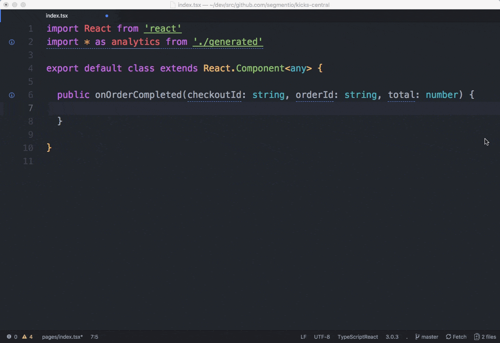

<p align="center">
	<br>
	<br>
  
  <br>
  <br>
  <br>
  <br>

  <a href="https://circleci.com/gh/segmentio/typewriter">
    
  </a>
  <a href="http://www.npmjs.com/package/typewriter">
    
  </a>
  <a href="./.github/LICENSE.md">
    
  </a>
  <a href="https://snyk.io/test/github/segmentio/typewriter?targetFile=package.json">
    
  </a>
  <br>
  <br>
  <br>

  
</p>

- 💪 **Strongly Typed Analytics**: Generates strongly-typed [Segment](http://segment.com) analytics clients that provide compile-time errors, along with intellisense for event/property names, types and descriptions.

- 👮 **Analytics Testing**: Validate your instrumentation matches your [spec](https://segment.com/docs/protocols/tracking-plan/) before deploying to production, so you can fail your CI builds without a manual analytics QA process.

- 🌐 **Cross-Language Support**: Supports native clients for [`analytics.js`](https://segment.com/docs/protocols/typewriter/#browser-quickstart), [`analytics-node`](https://segment.com/docs/protocols/typewriter/#node-js-quickstart), [`analytics-android`](https://segment.com/docs/protocols/typewriter/#android-quickstart) and [`analytics-ios`](https://segment.com/docs/protocols/typewriter/#ios-quickstart).

- ✨ **Segment Protocols**: Built-in support to sync your `typewriter` clients with your [centralized Segment Tracking Plans](https://segment.com/docs/protocols/tracking-plan/).

## Get Started

```sh
# Walks you through setting up a `typewriter.yml` and generating your first client.
$ npx typewriter init
```

For more instructions on setting up your `typewriter` client, such as adding it to your CI, see our [documentation](https://segment.com/docs/protocols/typewriter).

## Contributing

- To submit a bug report or feature request, [file an issue here](issues).
- To develop on `typewriter` or propose support for a new language, see [our contributors documentation](./.github/CONTRIBUTING.md).


## Migrating from v7

Check the instructions on our [documentation](https://segment.com/docs/protocols/typewriter)

- You'll need to change your Segment Config API Token for a Public API Token
- v8 doesn't support **Analytics-iOS** nor **Analytics-Android**. We recommend using [Analytics-Swift]() and [Analytics-Kotlin]() instead which are supported.
If you need to use these libraries you can run v7 specifying the version with your commands:

```sh
$ npx typewriter@7 build
```
